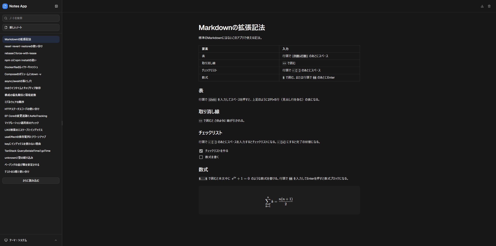
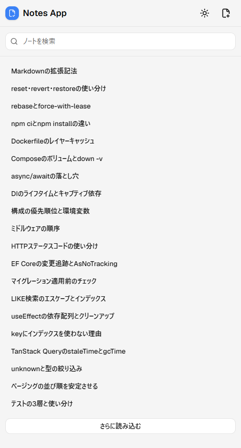
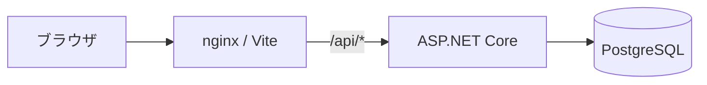
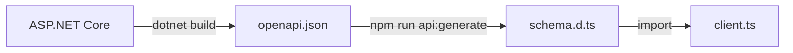

# Notes App

Markdownで書けるシンプルなノートアプリです。

自分で使いながら欲しい機能を追加しています。TypeScript / React、C# / ASP.NET Core、PostgreSQLを使ったフルスタックWebアプリ開発の学習も兼ねています。

## スクリーンショット

デスクトップ（システム設定に連動するダークテーマ）



モバイル（ライトテーマ）



## 主な機能

### 作成・編集・削除

- リッチテキストエディタ
  - Markdown記法の入力
  - `/`メニューからブロックを挿入
  - 文字を選択してツールバーから書式を設定
- コードブロック・拡張記法
  - コードブロックとシンタックスハイライト
  - 標準Markdownにはない拡張記法

#### 拡張記法の入力方法

| 要素           | 入力                                     |
| -------------- | ---------------------------------------- |
| 表             | 行頭で`\|列数x行数\|`のあとにスペース    |
| 取り消し線     | `~~`で囲む                               |
| チェックリスト | 行頭で`- [ ]`のあとにスペース            |
| 数式           | `$`で囲む、または行頭で`$$`のあとにEnter |

### 保存・エクスポート

- 入力停止から2秒後、またはノート切り替え時に自動保存
- ノートをMarkdown形式でエクスポート

### ノート一覧・検索・表示

- 更新日時の新しい順にノート一覧表示（20件ずつ追加読み込み）
- タイトルと本文の検索
- ライト、ダーク、システム設定に連動するテーマ
- 開閉、リサイズできるサイドバー（デスクトップのみ）

### キーボードショートカット

| 操作                                 | キー                 |
| ------------------------------------ | -------------------- |
| 新規作成                             | `Ctrl/Cmd + Alt + N` |
| 検索（デスクトップのみ）             | `Ctrl/Cmd + K`       |
| サイドバーの開閉（デスクトップのみ） | `Ctrl/Cmd + \`       |

## 使用技術

| 分類                 | 技術                                                                                                           |
| -------------------- | -------------------------------------------------------------------------------------------------------------- |
| フロントエンド       | TypeScript 5, React 19, Vite 8, React Router 8, TanStack Query 5, Zod 4, Tailwind CSS 4, shadcn/ui, Milkdown 7 |
| バックエンド         | C# / .NET 10, ASP.NET Core Minimal APIs, EF Core 10, FluentValidation 12                                       |
| データベース         | PostgreSQL 18                                                                                                  |
| フロントエンドテスト | Vitest, Testing Library, MSW                                                                                   |
| バックエンドテスト   | xUnit, Testcontainers                                                                                          |
| E2Eテスト            | Playwright                                                                                                     |
| インフラ・CI         | nginx, Docker Compose, GitHub Actions                                                                          |

## アーキテクチャ



## ディレクトリ構成

```text
.
├── .github/workflows/
├── backend/
│   ├── src/NotesApp.Api/
│   │   ├── Data/
│   │   ├── ExceptionHandling/
│   │   ├── Features/Notes/
│   │   └── Program.cs
│   ├── tests/NotesApp.Api.Tests/
│   │   ├── Integration/
│   │   └── Unit/
│   └── Dockerfile
├── frontend/
│   ├── src/
│   │   ├── api/
│   │   ├── app/
│   │   ├── components/
│   │   ├── features/notes/
│   │   ├── hooks/
│   │   ├── lib/
│   │   ├── pages/notes/
│   │   ├── test/
│   │   └── main.tsx
│   ├── tests/e2e/
│   ├── Dockerfile
│   └── nginx.conf
├── .env.example
└── docker-compose.yml
```

## 動作環境

- Docker
- Node.js 24（ローカル開発）
- .NET SDK 10（ローカル開発）

## セットアップ

始めに`.env`を作成します。

```bash
cp .env.example .env
```

サンプルデータを投入したい場合は`.env`を編集して`SEED_SAMPLE_DATA=true`にしてください。

### Dockerで起動

```bash
docker compose up --build
```

- アプリ: <http://localhost:8080>
- APIドキュメント: <http://localhost:5000/scalar>

### ローカル開発

それぞれ別ターミナルで実行します。

```bash
# データベース
docker compose up -d db
```

```bash
# バックエンド
cd backend
dotnet watch --project src/NotesApp.Api
```

```bash
# フロントエンド
cd frontend
npm ci
npm run dev
```

- アプリ: <http://localhost:5173>
- APIドキュメント: <http://localhost:5000/scalar>

## 設定

### `.env`

| 環境変数                | 既定値           |
| ----------------------- | ---------------- |
| `POSTGRES_PORT`         | `5432`           |
| `POSTGRES_DB`           | `notes_app`      |
| `POSTGRES_USER`         | `notes_app`      |
| `POSTGRES_PASSWORD`     | `local_password` |
| `E2E_POSTGRES_PORT`     | `5433`           |
| `E2E_POSTGRES_DB`       | `notes_app_e2e`  |
| `E2E_POSTGRES_USER`     | `notes_app_e2e`  |
| `E2E_POSTGRES_PASSWORD` | `local_password` |
| `SEED_SAMPLE_DATA`      | `false`          |

### ポート

データベースのポートは`.env`で設定します。

| 起動方法     | フロントエンド | バックエンド | データベース | 設定ファイル                           |
| ------------ | -------------: | -----------: | -----------: | -------------------------------------- |
| Dockerで起動 |         `8080` |       `5000` |       `5432` | `docker-compose.yml`                   |
| ローカル開発 |         `5173` |       `5000` |       `5432` | `vite.config.ts` `launchSettings.json` |
| E2Eテスト    |         `5174` |       `5001` |       `5433` | `playwright.config.ts`                 |

## 静的解析・テスト

### フロントエンド

フォーマットチェック、Lint、型チェック、テストを一括実行します。

```bash
cd frontend
npm run check
```

フォーマットチェックやLintでエラーになった場合は以下のコマンドで自動修正できます。

```bash
npm run format
npm run lint:fix
```

カバレッジを計測する場合は以下のコマンドを実行してください。レポートは`frontend/coverage/`に出力されます。

```bash
npm run test:coverage
```

### バックエンド

フォーマットチェックとテストを実行します。

```bash
cd backend
dotnet format --verify-no-changes
dotnet test
```

フォーマットチェックでエラーになった場合は以下のコマンドで自動修正できます。

```bash
dotnet format
```

統合テストはTestcontainersがDBコンテナを起動するため実行に少し時間がかかります。単体テストのみ実行したい場合は以下のコマンドを使用します。

```bash
dotnet test --filter "Category!=Integration"
```

カバレッジを計測する場合は以下のコマンドを実行してください。レポートは`backend/TestResults/coveragereport/`に出力されます。

```bash
# WindowsではGit Bashから実行してください
bash scripts/coverage.sh
```

カバレッジ用の設定ファイルは`backend/CodeCoverage.runsettings`にあります。

### E2Eテスト

E2Eテスト用のDBコンテナを起動します。

```bash
docker compose up -d db-e2e
```

Playwright用のブラウザをインストールします。初回またはPlaywright更新時に実行してください。

```bash
cd frontend
npx playwright install chromium
```

E2Eテストを実行します。フロントエンドとバックエンドはPlaywrightがE2Eテスト用のポートで起動します。

```bash
npm run test:e2e
```

## API型定義の再生成

バックエンドのエンドポイントやリクエスト、レスポンスの型を変更した場合は`openapi.json`と`schema.d.ts`を再生成してください。

```bash
# openapi.json
cd backend
dotnet build
```

```bash
# schema.d.ts
cd frontend
npm run api:generate
```



## データベース

スキーマはEntity Framework Coreのマイグレーションで管理しています。マイグレーションファイルは`backend/src/NotesApp.Api/Data/Migrations/`にあります。

マイグレーションの操作には`dotnet ef`を使います。初回またはツール更新時に実行してください。

```bash
cd backend
dotnet tool restore
```

### マイグレーションの追加

エンティティを変更した場合は新しいマイグレーションを追加します。

```bash
dotnet ef migrations add <マイグレーション名> --project src/NotesApp.Api
```

### マイグレーションの適用

`ASPNETCORE_ENVIRONMENT`が`Development`または`Testing`の場合、バックエンド起動時にマイグレーションが自動で適用されます。`Testing`はバックエンドの統合テスト、E2Eテストで使用します。

手動で適用するには以下のコマンドを使用してください。

```bash
dotnet ef database update --project src/NotesApp.Api
```

### データのリセット

すべてのデータを削除します。

```bash
docker compose down -v
```

[セットアップ](#セットアップ)の手順を参考に再度起動してください。

## 実装予定

- タイトルと本文をまたぐキーボード操作（矢印キー、Enter、Backspace、Deleteなど）
- 認証機能
- VPSへのデプロイ
- タグ機能

## ライセンス

[MIT License](LICENSE)
